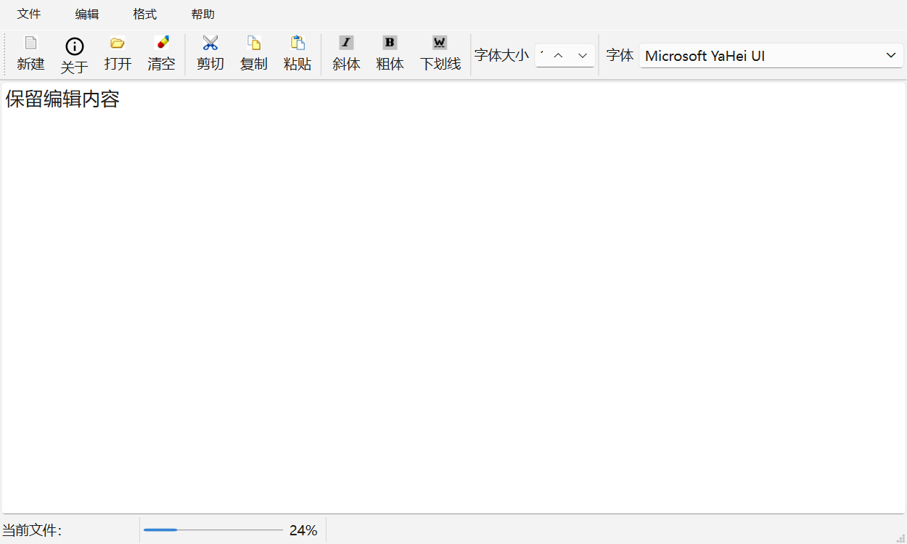
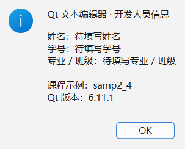

# QtCourse：Qt 工具栏与 About 窗口

这是 `samp2_4App` 文本编辑器课程示例。新增“关于”工具按钮、“帮助 → 关于”菜单和 F1 快捷键，弹窗显示姓名、学号、专业 / 班级、示例名称与 Qt 版本。





## 1. 先运行起来

1. 在 Qt Creator 中打开 `samp2_4App/samp2_4.pro`。
2. 选择已安装的 Desktop Qt 6.11.1 MinGW 64-bit Kit。
3. 点击构建，再点击绿色运行按钮（通常是 Ctrl+R）。
4. 点击工具栏“新建”旁边的“关于”，或者“帮助 → 关于”，也可以按 F1。
5. 弹窗中点击 OK 或按 Enter / Esc 关闭；原来的编辑内容保留。

## 2. 修改成自己的个人信息

打开 `samp2_4App/qwmainwind.cpp`，搜索 `on_actAbout_triggered`，修改这三行，保存后重新构建运行：

```cpp
const QString name = tr("待填写姓名");
const QString studentId = tr("待填写学号");
const QString className = tr("待填写专业 / 班级");
```

当前没有提供真实个人信息，所以使用明确占位文字；参考截图中的名字不作为你的姓名。

## 3. 按这个顺序理解实现

### 第一步：在 Designer 中建立动作

打开 `qwmainwind.ui` 进入设计模式，在 Action Editor（动作编辑器）中新建 QAction：

- objectName：`actAbout`
- text：`关于`
- icon：`:/icons/information-line.svg`
- toolTip：`查看姓名、学号等开发人员信息`
- shortcut：`F1`

将这个动作拖到工具栏，再拖到“帮助”菜单。项目中这些操作已经完成，可以直接在 Designer 中查看。

**QAction 表示“做什么”，QToolBar 将动作显示成工具按钮。** 同一个 QAction 可以出现在工具栏和菜单中，所以无需分别实现两套弹窗逻辑。

### 第二步：把图标打包到程序

`res.qrc` 增加：

```xml
<qresource prefix="/icons">
    <file alias="information-line.svg">images/information-line.svg</file>
</qresource>
```

`images/information-line.svg` 是磁盘上的文件；`:/icons/information-line.svg` 是程序内部的资源路径。qmake 会通过 rcc 将图片编译进程序，运行时无需联网下载图片。SVG 图标显示依赖 Qt 安装中的 SVG 图标插件；在 Qt Creator 的当前 Kit 中可正常加载。

图标来自 [Remix Icon v4.6.0](https://github.com/Remix-Design/RemixIcon/tree/v4.6.0)，对应 Apache-2.0 许可证保存在 `samp2_4App/images/RemixIcon-LICENSE`。

### 第三步：声明槽函数

在 `qwmainwind.h` 的 `private slots:` 下声明：

```cpp
void on_actAbout_triggered();
```

槽函数就是收到信号后执行的函数。这里采用 Qt 的自动连接命名规则 `on_对象名_信号名`。构造函数里的 `ui->setupUi(this)` 会调用自动连接机制，把 `actAbout` 的 `triggered` 信号连到这个槽。名称必须完全匹配，不需要再手写一次 connect，否则可能重复弹窗。

### 第四步：实现弹窗

在 `qwmainwind.cpp` 中包含 `<QMessageBox>`，然后实现上述槽。关键语句：

```cpp
QMessageBox aboutBox(this);
aboutBox.setWindowTitle(tr("关于 / About"));
aboutBox.setIcon(QMessageBox::Information);
aboutBox.setTextFormat(Qt::PlainText);
aboutBox.setText(tr("Qt 文本编辑器 · 开发人员信息"));
// 完整代码用 setInformativeText() 和 QString::arg() 填入个人信息。
aboutBox.setStandardButtons(QMessageBox::Ok);
aboutBox.exec();
```

`this` 指定主窗口为父窗口；`tr()` 为文字翻译预留支持；`%1`、`%2` 等占位符由 `.arg(...)` 替换；`exec()` 打开模态窗口，关闭后继续执行。

完整调用过程：点击工具按钮 → QAction 发出 triggered → 自动连接的槽函数执行 → QMessageBox 显示个人信息。

## 4. 处理的旧示例问题

- 将 `<Qlabel>` 改为正确大小写 `<QLabel>`。
- 字体选择改用 `QFontComboBox::currentFontChanged`，解决旧字符串信号在 Qt 6 中不匹配的问题。
- 手动连接的字体槽改用普通名称，避免被 `connectSlotsByName` 当成自动连接槽而报警。
- Qt 6 使用 `setFontFamilies`；旧版 Qt 保留 `setFontFamily` 分支。
- 初始窗口扩大到 1000 × 600，字号输入框加宽，便于显示工具栏。
- 原先源目录中的旧 `ui_qwmainwind.h` 已移到本地 `samp2_4App/build/ui_qwmainwind.original.h` 备份。这个头文件应由 uic 从 `.ui` 自动生成，不能手动维护，否则可能仍显示旧界面。

## 5. Git / GitHub 是怎样同步的

本地仓库根目录是包含这份 README 的 `QT` 文件夹。首次执行：

```powershell
git init -b main
git remote add origin git@github.com:lkq-guji/QtCourse.git
git add .
git commit -m "Add About action and Qt course guide"
git push -u origin main
```

`init` 创建本地仓库，`remote` 记录远端地址，`add` 将文件放入暂存区，`commit` 保存一版记录，`push` 上传到 GitHub。`-u` 设置上游，以后可以直接 `git push`。

以后修改代码后，在这个目录的终端运行：

```powershell
git status
git diff
git add samp2_4App/qwmainwind.cpp
git commit -m "Update About profile"
git push
```

根据实际修改添加其他文件。`.gitignore` 已排除 build、自动生成代码、exe、Qt Creator 本机配置以及原 ZIP 备份；这些文件留在本地即可，GitHub 保存可重新构建的源代码。

## 6. 验证

在本机 Qt 6.11.1 / MinGW 13.1.0 下构建。`samp2_4App/tests/about_test.pro` 是 Qt Test 项目，检查图标能加载、工具按钮和帮助菜单共用动作、两种入口都弹出带姓名与学号字段的窗口、Enter 关闭弹窗后编辑内容保留。

可在 Qt Creator 中打开这个测试 `.pro` 构建并运行。测试也会在运行目录保存 `main-window.png` 和 `about-window.png`，用于检查界面。主程序项目仍是 `samp2_4App/samp2_4.pro`。
