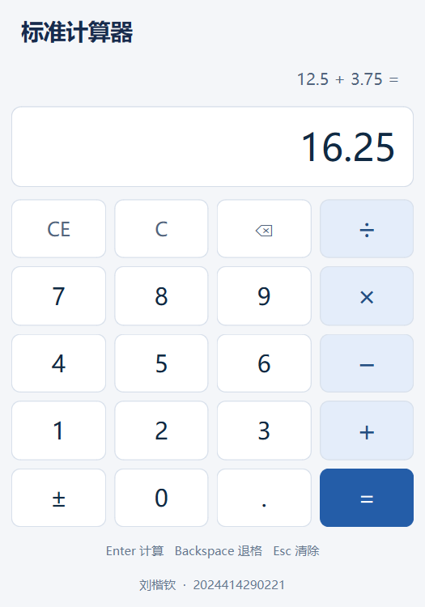

# 实验一 带键盘事件的计算器

刘楷钦，2024414290221，软件工程2班。Windows 11 / Qt 6.11.1 / MinGW 13.1.0。

本分支包含 Designer 可编辑的界面、计算状态机、Qt Test、150秒连续测试视频和填写完成的实验报告。

## 打开和运行

1. 在 Qt Creator 中打开 `calculator/calculator.pro`（进入源码目录后直接打开 `calculator.pro`）。
2. 选择 Desktop Qt 6.11.1 MinGW 64-bit Kit，构建并运行。
3. 双击 `calculatorwindow.ui` 查看和修改布局、控件名称、按钮的 command 属性。
4. 本机已完成构建，可双击仓库根目录的 `run-calculator.cmd` 启动。新克隆项目先在 Qt Creator 构建。

## 操作约定

| 功能 | 鼠标 | 键盘 |
| --- | --- | --- |
| 数字与四则运算 | 对应按钮 | 0–9、+、-、*、/ |
| 小数点 | . | . 或 , |
| 等号 | = | Enter、小键盘Enter、= |
| 退格 | ⌫ | Backspace |
| 全部清除 | C | Esc 或 C |
| 清除当前操作数 | CE | Delete |
| 正负号 | ± | F9 |

按标准计算器逐步运算，`2 + 3 × 4 = 20`。连续操作符替换待执行的操作符，连续等号重复上一轮运算。`5 + =` 等待第二操作数。结果后输入数字开始新计算；结果后输入操作符继续使用结果。除零显示错误，输入数字、C或CE可恢复。

数字输入最多15位，计算使用 double、结果显示15位有效数字。C清空全部状态；CE保留待执行运算并清除当前操作数。功能范围不包含百分号、科学计算和内存。

## 代码学习顺序

1. `calculatorwindow.ui`：QVBoxLayout组织显示区和提示，QGridLayout排列20个按钮。
2. `calculatorwindow.cpp`：连接所有 clicked，统一调用 `dispatch`。
3. `calculatorengine.h/.cpp`：Entering、WaitingOperand、Result、Error四种状态，集中处理命令。
4. `eventFilter`：只处理本窗口及子控件，ShortcutOverride只接管事件，KeyPress才执行命令。
5. `styles.qss`、`resources.qrc`：视觉样式及内嵌资源。

鼠标和键盘共用 `dispatch → engine.input`。参考 [Qt官方计算器示例](https://doc.qt.io/qt-6/qtwidgets-widgets-calculator-example.html) 的布局及集中处理思路；本实验采用约定的逐步运算。

## 实际测试与迭代

在 Qt Creator 打开 `calculator/tests/tests.pro`，构建并运行，覆盖状态机与真实窗口交互。

| 日志（仓库 artifacts 目录） | 通过 | 失败 | 阶段 |
| --- | --- | --- | --- |
| baseline-tests.txt | 22 | 4 | 键盘未接入，结果取反后算式未更新 |
| keyboard-tests.txt | 25 | 1 | 键盘接入后，剩余算式显示问题 |
| fixed-tests.txt | 28 | 0 | 修复算式后，增加焦点和截图测试 |
| final-tests.txt | 28 | 0 | 样式完成后的最终回归 |

报告列出四个真实问题的输入、旧现象、原因、修改和结果，原始失败日志保留。

## 报告和视频

仓库根目录下：

- [按原模板填写的实验报告](deliverables/实验1报告_刘楷钦_2024414290221_按原模板填写.docx)：提交用最新版。保留原模板全部标题、表格、编号、要求文字和参考图片，在对应位置补齐代码、说明、测试结果及3张运行截图。教师评语与成绩留空。
- `deliverables/实验1报告_刘楷钦_2024414290221.docx`：早期整理版，提交时请使用上面的最新版。
- `artifacts/calculator-demo.mp4`：150秒、1120×780、H.264、无音轨。展示鼠标小数、键盘、退格清除、除零恢复、连续运算、异常输入和录制时的Git历史。
- `deliverables/实验1提交包_刘楷钦_2024414290221.zip`：源码、报告、视频及日志的本地提交包，不在Git中重复上传压缩包。视频可单独上传作业系统附件。

视频由 `calculator/demo/demo.pro` 演示工具通过 Qt Test 发送真实鼠标键盘事件，连续捕获实际 QWidget。右侧文字记录每步操作，不是预制截图拼接。

## Git 分支

本次分支为 [experiment01-calculator](https://github.com/lkq-guji/QtCourse/tree/experiment01-calculator)，逐步提交界面、引擎、测试、键盘、修复、样式和验证证据。

本机上传目录为 `QT/worktrees/experiment01-calculator`，在这里修改后用 `git add`、`git commit`、`git push` 更新本实验。[main](https://github.com/lkq-guji/QtCourse/tree/main) 维护导航。

